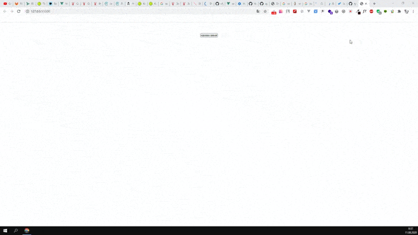

# A simple application to explore the possibilities of using the following technologies:
-  ajax;
-  axios.

## Deployment.
- Install Node.js
- Clone the project and install the necessary dependencies:
```
git clone https://github.com/antonsaf18/ajax-axios.git
cd ajax-axios
npm install -g json-server
json-server db.json
Go Live
```


123